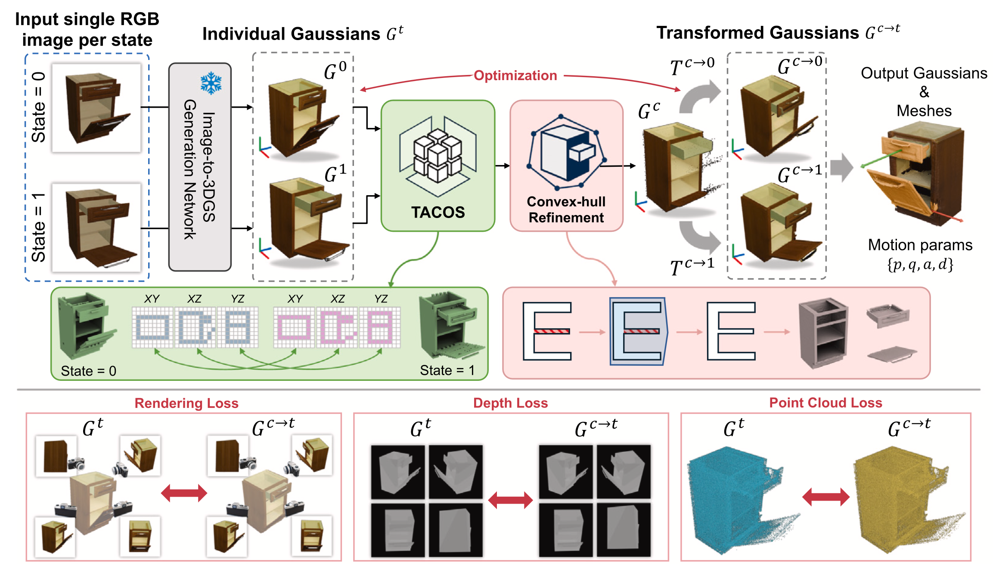

# Single Image-based Gaussian Splatting for 3D Reconstruction of Movable Articulated Objects

Official PyTorch implementation of **Single Image-based Gaussian Splatting for 3D Reconstruction of Movable Articulated Objects**.

Hwanhee Jung, Seunggwan Lee, Jeongyoon Yoon, Qixing Huang, Sangpil Kim

[\[Paper\]](https://www.sciencedirect.com/science/article/abs/pii/S1474034625010845?DGCID=STMJ_220042_AUTH_SERV_PPUB&lid=jua9g5tkojjo&utm_campaign=STMJ_220042_AUTH_SERV_PPUB&utm_content=07bab9e4-c31e-408b-afa5-1c9ca0f269ca&utm_medium=email&utm_source=braze&utm_term=07bab9e4-c31e-408b-afa5-1c9ca0f269ca)

<div align="center">
  
</div>

<br>

## Environment

Create and activate the Anaconda environment:
```bash
conda create -n sigma python=3.10
conda activate sigma
```

Install PyTorch:
```bash
conda install pytorch==2.4.1 torchvision==0.19.1 torchaudio==2.4.1 pytorch-cuda=12.1 -c pytorch -c nvidia
```

Install PyTorch3D and tiny-cuda-nn:
```bash
pip install git+https://github.com/facebookresearch/pytorch3d.git
pip install git+https://github.com/NVlabs/tiny-cuda-nn/#subdirectory=bindings/torch
```

Build pointnet_lib for nearest farthest point sampling:
```bash
cd utils/pointnet_lib
python setup.py install
cd ../..
```

Install submodules:
```bash
# a modified gaussian splatting (+ depth, alpha rendering)
pip install ./submodules/diff-gaussian-rasterization

# simple-knn
pip install ./submodules/simple-knn
```

Install remaining dependencies:
```bash
pip install -r requirements.txt
```

## Preparation

<!-- TODO: Add data download link -->
You can download data from the [previous work](https://github.com/YuLiu-LY/ArtGS)

Pretrained checkpoints can be downloaded [here](https://kuaicv.synology.me/weights/AEI25/SIGMA/results.zip).

## Common Commands

Train and evaluate using the unified pipeline (coarse → align → per-state render → predict → train → render_video → eval):
```bash
bash scripts/pipeline.sh --dataset artgs --subset sapien --scenes excavator --cuda 0
```

Or equivalently via Python:
```bash
python scripts/pipeline.py --dataset artgs --subset sapien --scenes excavator --cuda 0
```

Run only a subset of stages:
```bash
bash scripts/pipeline.sh --dataset artgs --subset sapien --scenes excavator,lamp \
  --stages coarse,align,predict,train --cuda 0
```

You can override defaults with the following flags:

| Flag | Description |
|------|-------------|
| `--dataset` | Dataset name (default: `artgs`) |
| `--subset` | Subset name (default: `sapien`) |
| `--scenes` | Comma-separated list of scenes to process |
| `--stages` | Comma-separated stages to run (default: all) |
| `--cuda` | GPU device ID (`CUDA_VISIBLE_DEVICES`) |
| `--skip-existing` | Skip stages whose outputs already exist |
| `--dry-run` | Print commands without executing |
| `--no-random-bg` | Disable random background color |
| `--no-art-type-prior` | Disable articulation type prior |

## Citation
```tex
@article{jung2026single,
  title={Single image-based Gaussian splatting for 3D reconstruction of movable articulated objects},
  author={Jung, Hwanhee and Lee, Seunggwan and Yoon, Jeongyoon and Huang, Qixing and Kim, Sangpil},
  journal={Advanced Engineering Informatics},
  volume={70},
  pages={104191},
  year={2026},
  publisher={Elsevier}
}
```

## Acknowledgement
We thank the fantastic works [PARIS](https://github.com/3dlg-hcvc/paris), [DTA](https://github.com/NVlabs/DigitalTwinArt), and [ArtGS](https://articulate-gs.github.io/) for their pioneer code release.
